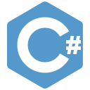

# Leandro Cardoso

  
  &emsp;
  
   
  <a href="mailto:leandrocardosodev@gmail.com">
    leandrocardosodev@gmail.com
  </a>

&nbsp;

## Status:
* Open to work ✔️
### Working on:
* [Estudo de TypeScript](https://github.com/Leandro-Cardoso/STUDY-TypeScript) ⚙️🔨
* [My portfolio](https://github.com/Leandro-Cardoso/SITE-Portfolio-Leandro-Cardoso) ⚙️🔨
* [Estudo de Algoritmos](https://github.com/Leandro-Cardoso/STUDY-Vassouras-Algoritmos) ⚙️🔨
* [Estudo de Programação Web](https://github.com/Leandro-Cardoso/STUDY-Vassouras-Laboratorio-de-Programacao-de-Web-Sites) ⚙️🔨

## Technologies:

  <table>
    <tr>
      <td width="150px">
        &emsp;<b>Back-End:</b>
      </td>
      <td>
        
        
        
        
        
      </td>
    </tr>
    <tr>
      <td>
        &emsp;<b>Front-End:</b>
      </td>
      <td>
        
        
        
        
        
      </td>
    </tr>
    <tr>
      <td>
        &emsp;<b>More:</b>
      </td>
      <td>
        
      </td>
    </tr>
    <tr>
      <td>
        &emsp;<b>Learning:</b>
      </td>
      <td>
        
      </td>
    </tr>
  </table>
  
  

