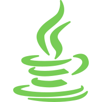
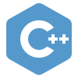

# Leandro Cardoso

  
  &emsp;
  
   
  <a href="mailto:leandrocardosodev@gmail.com">
    leandrocardosodev@gmail.com
  </a>

&nbsp;

## Status:
* Open to work ✔️
* IT Intern
### Working on:
* Quick projects:
  * [Estudo de POO em Java](https://github.com/Leandro-Cardoso/Java-POO) ⚙️🔨
  * [Estudo de Estrutura de Dados em Python e C++](https://github.com/Leandro-Cardoso/Vassouras-Estrutura-de-Dados) ⚙️🔨
  * [Estudo de POO em Python e Java](https://github.com/Leandro-Cardoso/Univassouras-POO) ⚙️🔨
  * [Estudo de Front End em Java](https://github.com/Leandro-Cardoso/Univassouras-Front-End-Java) ⚙️🔨
  * [Estudo de Física com Python e Java](https://github.com/Leandro-Cardoso/Univassouras-Fisica) ⚙️🔨
  * [Estudo de Engenharia Economica com Java](https://github.com/Leandro-Cardoso/Univassouras-Engenharia-Economica) ⚙️🔨
  * [My portfolio layout (remake in Java)](https://github.com/Leandro-Cardoso/SITE-Portfolio-Leandro-Cardoso) ⚙️🔨

* Long projects:
  * **Leandro Cardoso {Dev}** - My Back End projects portfolio in Java ⚙️🔨
  * **Emprego Seguro** - **LOC** - Um aplicativo de serviços de freelancer e emprego regional (projeto de faculade em grupo) ⚙️🔨
  * **Game Engine** - A multiplatform Game Engine in Java (solo colege final project) ⚙️🔨
  * Other projects in the future...

## Technologies:
Conhecimento Full Stack mas com FOCO em Back End.

  <table>
    <tr>
      <td width="150px">
        &emsp;<b>Main:</b>
      </td>
      <td>
        
        
        
        
      </td>
    </tr>
    <tr>
      <td>
        &emsp;<b>Others:</b>
      </td>
      <td>
        
        
        
        
        
        
      </td>
    </tr>
    <tr>
      <td>
        &emsp;<b>Tools:</b>
      </td>
      <td>
        
        
        
      </td>
    </tr>
    <tr>
      <td>
        &emsp;<b>Learning:</b>
      </td>
      <td>
        
      </td>
    </tr>
  </table>
  
  

